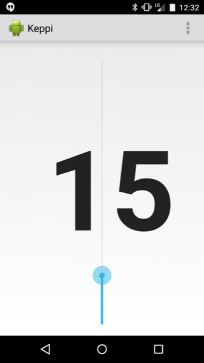

Keppi
=====

Simple Android app for connecting via Bluetooth LE to the Keppi stick.

Basically, scan for and connect to an RFDuino (in this case, the [RFDuino
component of the Keppi stick](https://github.com/philadams/keppi-arduino)).
Then display the incoming values in a slider widget.

See [the releases folder](./releases) for the latest release(s).

License
-------

This project licensed under the MIT license.

Originally largely based on (Lann's RFDuinoTest project)[1], which is copyright
2013 Lann and MIT licensed. Some of that work (namely, the RFduinoService) is
adapted from the Apache v2 licensed Android Open Source Project.

Copyright
---------

Copyright 2015 Phil Adams

Parts of the project Copyright 2013 Lann.

Parts of the project adapted from code Copyright 2013 The Android Open Source
Project.

[1] https://github.com/lann/RFDuinoTest
